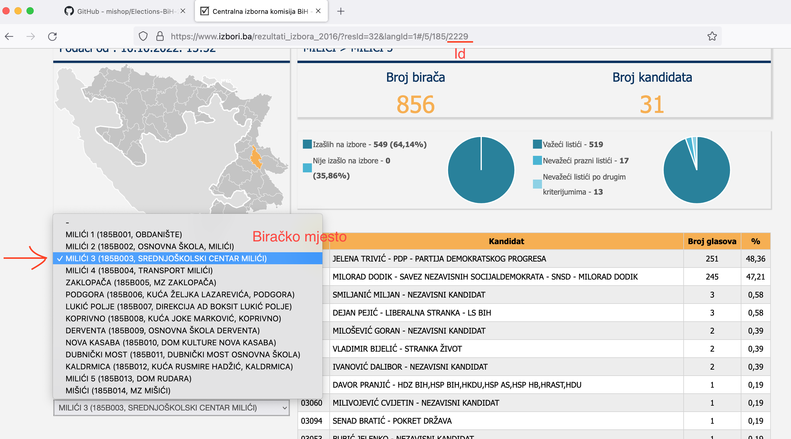

# Bosnia and Herzegovina elections 2022

## CSV and JSON data BiH elections 2022

To get json and csv raw data run command:
`go run presiednet.go`

## Download data
Go to folder [data](data/) and choice csv or json foramt. 

## JSON structure
```
[
 {
  "id": 2,
  "name": "Kandidat 1",
  "totalVotes": 82,
  "percentage": 48.52
 },
 {
  "id": 2,
  "name": "Kandidat 2",
  "totalVotes": 78,
  "percentage": 46.15
 },
 ]
 ```

## CSV table structure
| Id  | Name  | TotalVotes  | Percentage  |
|---|---|---|---|
| Biračko mjesto broj | Kandidat 1 |  Ukupno glasova | Procenat glasova  |
| Biračko mjesto broj | Kandidat 1 |  Ukupno glasova | Procenat glasova  |

## Id
Id is identification number of the polling station used by the Central Election Commission. (Izbori.ba)



## Import to Excel
File -> Import -> CSV file -> Choice csv file > File origin UTF-8 


## Benford's Law (The Last Digit Test)
